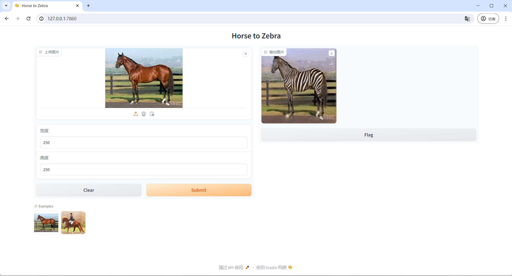

# Horse to Zebra

`toy project` `pytorch` `onxx` `gradio` `gan` `horse2zebra` `cycleGAN`


A simple project to convert Pytorch model to ONXX model and deploy it with Gradio.

### 0. Install Requirements

```shell
conda create -n horse2zebra python=3.10
pip install torch torchvision gradio numpy onnxruntime-gpu
```
> Note: `cuda' and `cudnn' are required for `onnxruntime-gpu` to work with GPU. 

### 1. Pytorch Model Convert ONXX

Model from [Deep Learning with PyTorch](https://github.com/deep-learning-with-pytorch/dlwpt-code/blob/master/p1ch2/3_cyclegan.ipynb)

```shell
python convert2onxx.py
```

### 2. Deploy ONXX Model With Gradio

```shell
python app.py
```

### 3. Test

